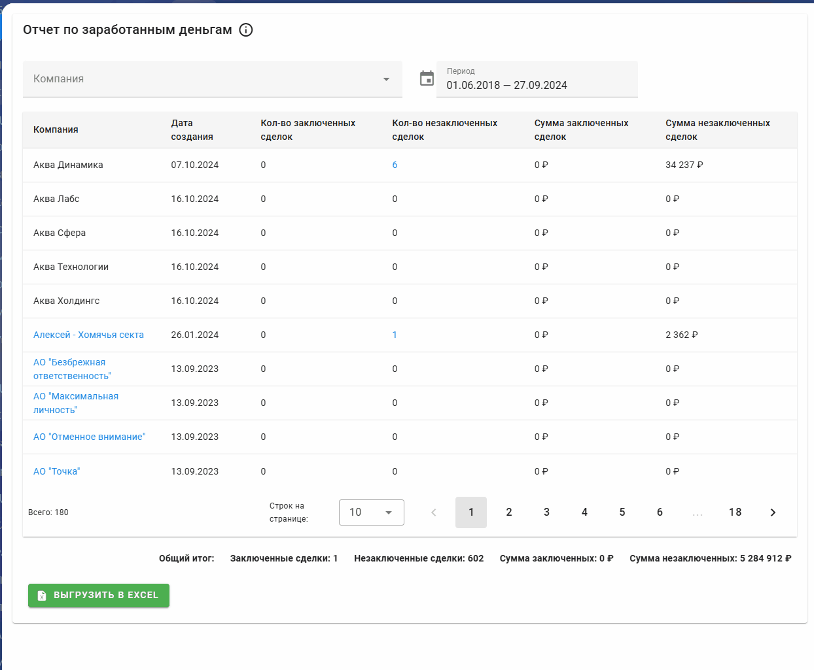

# Отчет по заработанным деньгам компаний для Битрикс24

Финансовый отчет для анализа прибыльности работы с клиентами в Bitrix24.

## Кейс

- **Задача:** Стандартные отчеты CRM не позволяли быстро оценить, какие клиенты приносят больше всего денег. Для анализа доходности приходилось вручную собирать данные по успешным и проваленным сделкам, что было долго и неудобно.

- **Решение:** Разработано приложение, которое формирует сводный отчет по доходности в разрезе компаний. Оно показывает сумму успешных сделок (заработанные деньги) и сумму сделок в работе, позволяя оценить как текущую, так и потенциальную прибыль. Данные можно выгрузить в Excel.

- **Результат:** Руководители и менеджеры получили возможность за несколько секунд определять самых прибыльных клиентов.

### Основные показатели отчета:

- **Компания** — название компании с возможностью перехода в карточку компании
- **Дата создания компании** — когда была создана компания в Битрикс24
- **Количество заключенных сделок** — число успешно закрытых сделок с компанией
- **Количество незаключенных сделок** — число сделок в работе или отклоненных
- **Сумма заключенных сделок** — общая сумма по всем успешно завершенным сделкам
- **Сумма незаключенных сделок** — общая сумма по всем незавершенным сделкам

### Общий итог:

В нижней части отчета отображаются суммарные показатели:

- Общее количество заключенных сделок
- Общая сумма заключенных сделок
- Общая сумма незаключенных сделок

### Фильтры:

- **Компания** — выбор одной или нескольких компаний для анализа
- **Период** — диапазон дат завершения сделок для включения в отчет

## Интерактивные элементы

- **Название компании** — клик открывает карточку компании в Битрикс24
- **Количество сделок** — клик открывает список сделок с деталями
- **Названия сделок в списке** — клик открывает карточку сделки в Битрикс24
- **Экспорт данных** — возможность сохранения отчета для дальнейшей обработки или презентации

### Стек: Vue.js (Frontend), Node.js (Backend), Docker, Bitrix24 REST API.
### Срок разработки: 4 дня.

